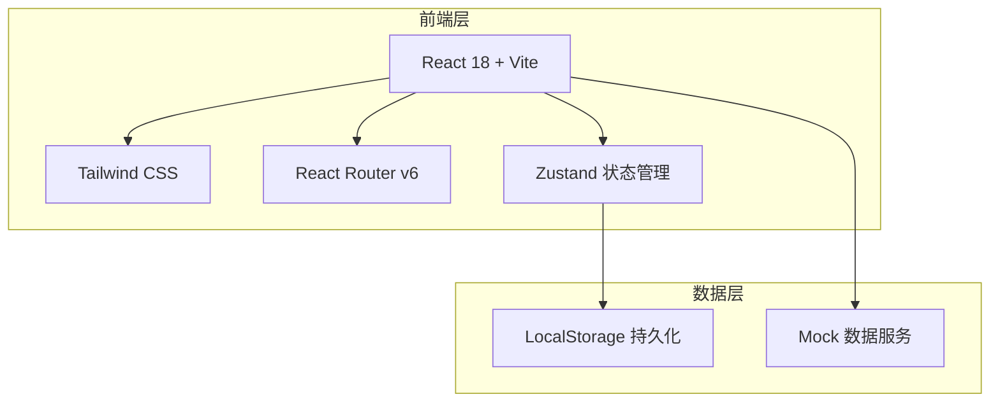
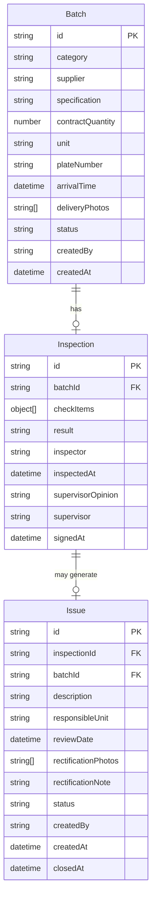

## 1. 架构设计



## 2. 技术说明

- **前端框架**：React@18 + TypeScript
- **构建工具**：Vite
- **样式方案**：Tailwind CSS@3
- **路由**：React Router v6
- **状态管理**：Zustand（轻量级，适合中小型应用）
- **图标库**：Lucide React
- **后端**：无后端，使用 LocalStorage 持久化 + Mock 数据
- **数据库**：无，LocalStorage 模拟数据存储

## 3. 路由定义

| 路由 | 用途 |
|------|------|
| / | 重定向到 /batches |
| /batches | 待验收批次页面——批次列表、录入、详情 |
| /inspections | 现场验收单页面——验收检查、监理签署 |
| /issues | 问题闭环页面——整改单列表、处理、关闭 |

## 4. 数据模型

### 4.1 数据模型定义



### 4.2 数据定义

```typescript
type MaterialCategory = '钢筋' | '水泥' | '防水卷材' | '混凝土' | '砖块' | '砂石' | '其他';

type BatchStatus = '待验收' | '验收中' | '已完成';

type InspectionResult = '可接收' | '需复检' | '拒收';

type IssueStatus = '待整改' | '整改中' | '已关闭';

type UserRole = '材料员' | '质检员' | '监理工程师';

interface CheckItem {
  name: string;
  passed: boolean | null;
  remark?: string;
}

interface Batch {
  id: string;
  category: MaterialCategory;
  supplier: string;
  specification: string;
  contractQuantity: number;
  unit: string;
  plateNumber: string;
  arrivalTime: string;
  deliveryPhotos: string[];
  status: BatchStatus;
  createdBy: UserRole;
  createdAt: string;
}

interface Inspection {
  id: string;
  batchId: string;
  checkItems: CheckItem[];
  result: InspectionResult | null;
  inspector: string;
  inspectedAt: string | null;
  supervisorOpinion: string;
  supervisor: string;
  signedAt: string | null;
}

interface Issue {
  id: string;
  inspectionId: string;
  batchId: string;
  description: string;
  responsibleUnit: string;
  reviewDate: string;
  rectificationPhotos: string[];
  rectificationNote: string;
  status: IssueStatus;
  createdBy: string;
  createdAt: string;
  closedAt: string | null;
}
```

## 5. 状态管理设计

使用 Zustand 创建全局 Store，管理以下状态：

- **currentRole**：当前用户角色（材料员/质检员/监理工程师）
- **batches**：批次数据列表
- **inspections**：验收单数据列表
- **issues**：整改单数据列表
- **CRUD 操作**：各实体的增删改查方法
- **持久化**：通过 Zustand persist 中间件将数据写入 LocalStorage

## 6. 组件结构

```
src/
├── components/
│   ├── Layout/
│   │   ├── Sidebar.tsx          # 左侧导航栏
│   │   ├── Header.tsx           # 顶部栏（项目名+角色切换）
│   │   └── AppLayout.tsx        # 整体布局容器
│   ├── Batch/
│   │   ├── BatchList.tsx        # 批次列表
│   │   ├── BatchForm.tsx        # 批次录入表单
│   │   └── BatchDetail.tsx      # 批次详情抽屉
│   ├── Inspection/
│   │   ├── InspectionList.tsx   # 验收单列表（看板视图）
│   │   ├── InspectionForm.tsx   # 验收检查表
│   │   └── SignPanel.tsx        # 监理签署面板
│   ├── Issue/
│   │   ├── IssueList.tsx        # 整改单列表
│   │   ├── IssueForm.tsx        # 整改单生成表单
│   │   └── RectifyPanel.tsx     # 整改结果补传面板
│   └── ui/
│       ├── StatusBadge.tsx      # 状态徽标
│       ├── PhotoUpload.tsx      # 照片上传组件
│       ├── PhotoViewer.tsx      # 照片灯箱预览
│       └── Modal.tsx            # 模态弹窗
├── pages/
│   ├── BatchesPage.tsx          # 待验收批次页
│   ├── InspectionsPage.tsx      # 现场验收单页
│   └── IssuesPage.tsx           # 问题闭环页
├── store/
│   └── useStore.ts              # Zustand 全局状态
├── types/
│   └── index.ts                 # TypeScript 类型定义
├── data/
│   └── mock.ts                  # Mock 初始数据
├── App.tsx
├── main.tsx
└── index.css
```
